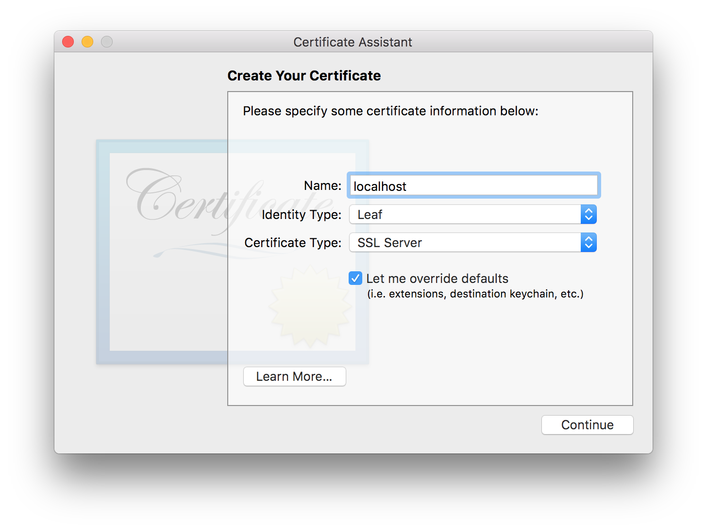
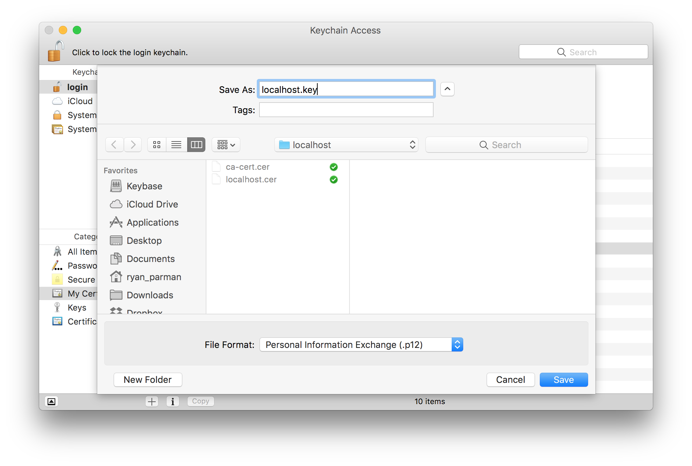

# How to create local TLS certificates for development on macOS

Largely based on [“Generating Self-Signed SSL Certificates for Use with Bluemix Custom Domains”](https://www.tonyerwin.com/2014/09/generating-self-signed-ssl-certificates.html), by Tony Erwin.

The examples in this tutorial are from macOS Sierra (10.12).

## Table of Contents

* [Create a local Certificate Authority](#create-a-local-certificate-authority)
    * [Open the Certificate Assistant](#open-the-certificate-assistant)
    * [Enter the Values](#enter-the-values)
    * [Created\!](#created)
    * [Trust the New CA](#trust-the-new-ca)
* [Create a local Certificate from your new Certificate Authority](#create-a-local-certificate-from-your-new-certificate-authority)
    * [Open the Certificate Assistant](#open-the-certificate-assistant-1)
    * [Create your Certificate](#create-your-certificate)
    * [Configuring Validity](#configuring-validity)
    * [Configuring the Organizational Unit](#configuring-the-organizational-unit)
    * [Choose an Issuer](#choose-an-issuer)
    * [Keypair Information](#keypair-information)
    * [Key Usage Extension](#key-usage-extension)
    * [Extended Key Usage Extension](#extended-key-usage-extension)
    * [Basic Constraints](#basic-constraints)
    * [Subject Alternate Name Extension](#subject-alternate-name-extension)
    * [Specify a Location for the Certificate](#specify-a-location-for-the-certificate)
    * [All Done\!](#all-done)

## Create a local Certificate Authority

By creating a Certificate Authority (a.k.a., a “CA”) and trusting it locally, any certificate that we create using this CA will also be trusted locally. This can simplify the development of _HTTPS_ websites on your local machine.

Start by opening _Keychain Access_. You can either search for it inside Spotlight, or you can traverse the file system for _Computer_ → _Applications_ → _Utilities_ → _Keychain Access_.

### Open the Certificate Assistant

Go to the _Keychain Access_ menu, and choose _Certificate Assistant_ → _Create a Certificate Authority…_.


You should see the new Certificate Assistant.

### Enter the Values


1. Give it a name.
1. **Identity Type** should be _Self Signed Root CA_.
1. **User Certificate** should be _SSL Server_.
1. **Let me override defaults** should be _unchecked_.
1. **Make this CA the default** is optional.
1. Add your email address.

When you're done, choose the _Create_ button.

### Created!


All done! Feel free to close this window.

### Trust the New CA

Now, you should be looking at your Keychain. Select _My Certificates_ from the sidebar to filter down the list to what we care about.


You'll notice that, by default, our new CA is not trusted. Right-click (or control-click, or two-finger click) the new CA, and choose _Get Info_.


Make sure that the _Trust_ section is visible. Click the small triangle if it isn't.

You should see that the default settings are configured for _System Defaults_, and that “This root certificate is not trusted”.


Next to _When using this certificate:_, open the pull-down menu and choose _Always Trust_.


All of the options should now flip to _Always Trust_.


But we're not quite done! When we close the window, we'll be asked for our system password. You need to provide your password correctly before the settings will take effect.


## Create a local Certificate from your new Certificate Authority

### Open the Certificate Assistant


### Create your Certificate



1. **Name** should be the hostname you want to create the certificate for (e.g., `localhost`, `*.google.com`).
1. **Identity Type** should be _Leaf_.
1. **Certificate Type** should be _SSL Server_.
1. **Let me override defaults** should be _checked_.

When you're done, choose the _Continue_ button.

### Configuring Validity


The default _Validity Period_ is 365 days. You could also set it to 2 years (730 days), 3 years (1095 days), or any amount you want. (This is a local-only certificate, after all.)

When you're done, choose the _Continue_ button.

### Configuring the Organizational Unit


1. **Email Address** should be your email address. Again, this is a local-only certificate, so this is generally unimportant.
1. **Name (Common Name)** should be the hostname you want to create the certificate for (e.g., `localhost`, `*.google.com`).
1. **Organization** should be your company or organization.
1. **Organizational Unit** is a smaller group inside of your company or organization.
1. **City**, **State**, **Country** should all be self-explanitory.

When you're done, choose the _Continue_ button.

### Choose an Issuer


This should be the certificate authority that you created earlier.

When you're done, choose the _Continue_ button.

### Keypair Information


Leave this as-is. When you're done, choose the _Continue_ button.

### Key Usage Extension


1. **Include Key Usage Extension** should be _checked_.
1. **This extension is critical** should be _checked_.
1. **Signature** should be _checked_.
1. Everything else should be _unchecked_.

When you're done, choose the _Continue_ button.

### Extended Key Usage Extension


1. **Include Extended Key Usage Extension** should be _checked_.
1. **This extension is critical** should be _checked_.
1. **SSL Server Authentication** should be _checked_.
1. Everything else should be _unchecked_.

When you're done, choose the _Continue_ button.

### Basic Constraints


Leave this as-is. When you're done, choose the _Continue_ button.

### Subject Alternate Name Extension


This _should_ be disabled because we don’t need a SAN. If you encounter an error with this selection, you can enable it and set the **dNSName** value to the same thing as your _Common Name_ was (e.g., `localhost`, `*.google.com`).


When you're done, choose the _Continue_ button.

### Specify a Location for the Certificate


This should be your _login_ keychain, which gets unlocked whenever you login.

When you're done, choose the _Continue_ button.

### All Done!


You should notice that since we trusted our custom CA, and we configured that CA as the _Issuer_ for this certificate, that this certificate is already trusted by default.

When you're done, choose the _Done_ button.

## Exporting your Keypair Files

### Export your Root CA Certificate

Select your root CA.


Right-click (or control-click, or two-finger click) the new CA, and choose _Export…_.


You'll see a _Save As…_ dialog box, asking where you want to save your exported file. Type _Command-Shift-G_ (⌘⇧G) to bring up a sub-dialog where you can enter the path that you want to traverse to.


You can put the files anywhere you'd like, but in this example, I'm going to use `~/.ssh/localhost/`.

Since this path doesn’t exist by default, you can enter `~/.ssh/`, press _Return_, then choose the _New Folder_ button along the bottom-left, and name it _localhost_.


Again, you can give the file any name which makes sense to you. I'm going to use `ca-cert` in this example. For the **File Format**, choose _Certificate (.cer)_.

When you're done, choose the _Save_ button.

### Export your Certificate

Select your certificate.


Right-click (or control-click, or two-finger click) the new certificate, and choose _Export…_.

You'll see a _Save As…_ dialog box, asking where you want to save your exported file.


Again, you can give the file any name which makes sense to you. I would recommend giving the file the same name as the domain, e.g., `localhost` in this example. For the **File Format**, choose _Certificate (.cer)_.

When you're done, choose the _Save_ button.

### Export your Private Key

Select the private key for your certificate.


Right-click (or control-click, or two-finger click) the new private key, and choose _Export…_.

You'll see a _Save As…_ dialog box, asking where you want to save your exported file.



Again, you can give the file any name which makes sense to you. I would recommend giving the file the same name as the domain + `.key`, e.g., `localhost.key` in this example. For the **File Format**, choose _Personal Information Exchange (.p12)_.

When you're done, choose the _Save_ button. You will probably see a dialog which complains about the file extension.


Choose _Use both_.

## Converting Files into PEM Format

Open _Terminal_, and navigate to the directory where we saved our exported files.

```bash
cd ~/.ssh/localhost/
```

We're going to use the `openssl` command to convert our exported files into the widely-supported PEM format.

### Convert the Private Key from P12 → PEM

```bash
openssl pkcs12 -in localhost.key.p12 -nocerts -nodes | openssl rsa > localhost.key.pem
```

### Convert the Certificate from CER → PEM

```bash
openssl x509 -inform der -in localhost.cer -out localhost.cer.pem
```

### Convert the root CA from CER → PEM

```bash
openssl x509 -inform der -in ca-cert.cer -out ca-cert.cer.pem
```

### Confirming Files


## Putting these Certificates to Use

You now have a root CA, a certificate, and a private key that can be used on your local machine for faux-HTTPS connections.

As an example for how these can be used, we'll install the [`http-server` package from npm](https://www.npmjs.com/package/http-server). (You'll need [Node.js](https://nodejs.org) installed; See [Install `npm` packages globally without sudo on macOS and Linux](https://github.com/sindresorhus/guides/blob/master/npm-global-without-sudo.md) for how to do this without `sudo`.)

### Installing `http-server`

```bash
npm install -g http-server
```

After the package is installed, you can run a local HTTPS server using the contents of the current directory.

```bash
http-server --ssl \
    --cert ~/.ssh/localhost/star.mheducation.cer.pem \
    --key ~/.ssh/localhost/star.mheducation.key.pem \
    -p 8443
```

Now you can open <https://localhost:8443> in your web browser.

## Pretending to be another website, locally

Let's say that you want to pretend to be `fake.google.com`, locally.

Perhaps you're testing something with CORS, or cookies, or something else where the domain name matters.

1. After creating your root CA, create a new certificate where the common name is `*.google.com`. (Again, this will only work on your local machine.) Follow the same instructions you followed for `localhost`.

1. Run `http-server` using your new fake `*.google.com` certificates. But instead, run it on port `443`. Since the port that we want to bind to is smaller than 1000, we'll need to use `sudo`.

1. In your `/etc/hosts` file, add a line that says `127.0.0.1 fake.google.com`.

1. In your web browser, visit <https://fake.google.com> and you'll see that it loads successfully. However, if you click on the lock in the address bar and view the certificate, you'll see that the certificate was issued by your own custom root CA.
