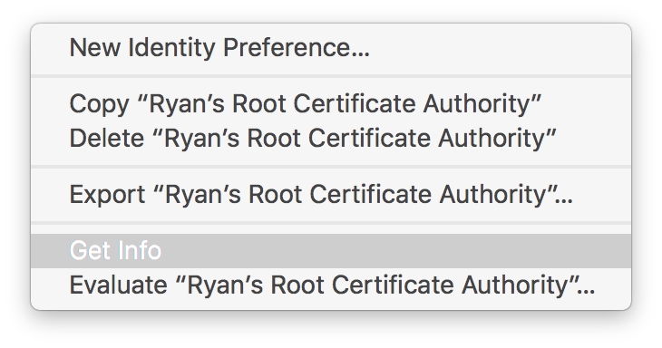

# How to create local TLS certificates for development on macOS

Largely based on [“Generating Self-Signed SSL Certificates for Use with Bluemix Custom Domains”](https://www.tonyerwin.com/2014/09/generating-self-signed-ssl-certificates.html), by Tony Erwin.

The examples in this tutorial are from macOS Sierra (10.12).

## Create a local Certificate Authority

By creating a Certificate Authority (a.k.a., a “CA”) and trusting it locally, any certificate that we create using this CA will also be trusted locally. This can simplify the development of _HTTPS_ websites on your local machine.

Start by opening _Keychain Access_. You can either search for it inside Spotlight, or you can traverse the file system for _Computer_ → _Applications_ → _Utilities_ → _Keychain Access_.

### Create a Certificate Authority

Go to the _Keychain Access_ menu, and choose _Certificate Assistant_ → _Create a Certificate Authority…_.

You should see the new Certificate Assistant.

1. Give it a name.
1. **Identity Type** should be _Self Signed Root CA_.
1. **User Certificate** should be _SSL Server_.
1. **Let me override defaults** should be _unchecked_.
1. **Make this CA the default** is optional.
1. Add your email address.

When you're done, choose the _Create_ button.

All done! Feel free to close this window.

Now, you should be looking at your Keychain. Select _My Certificates_ from the sidebar to filter down the list to what we care about.

You'll notice that, by default, our new CA is not trusted. Right-click (or control-click, or two-finger click) the new CA, and choose _Get Info_.

Make sure that the _Trust_ section is visible. Click the small triangle if it isn't.

You should see that the default settings are configured for _System Defaults_, and that “This root certificate is not trusted”.

Next to _When using this certificate:_, open the pull-down menu and choose _Always Trust_.

All of the options should now flip to _Always Trust_.

But we're not quite done! When we close the window, we'll be asked for our system password. You need to provide your password correctly before the settings will take effect.

